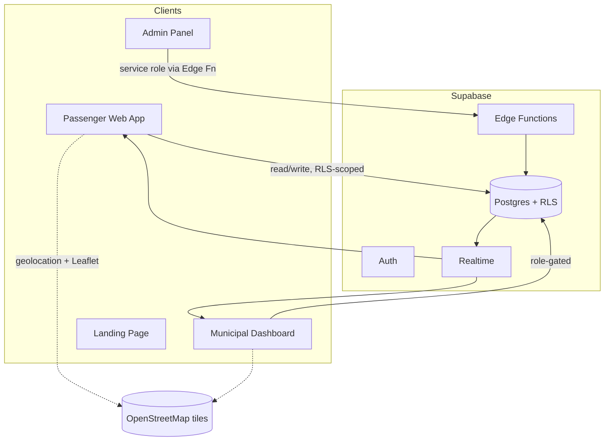

# Transit AI

**Buses should follow demand.**

Transit AI is a demand-intelligence and dynamic fleet allocation platform. Instead of forcing people to adapt to fixed routes and timetables, it lets transportation capacity respond, in real time, to where people actually need it.

<p align="left">
  
  
  
  
  
  
  
</p>

**Live demo:** [transit-ai-zeta-one.vercel.app](https://transit-ai-zeta-one.vercel.app/)

---

## Table of Contents

- [The Idea](#the-idea)
- [Dashboards & Access Levels](#dashboards--access-levels)
- [Features](#features)
- [Why It's Different](#why-its-different)
- [Architecture](#architecture)
- [Tech Stack](#tech-stack)
- [Getting Started](#getting-started)
- [Project Structure](#project-structure)
- [Edge Cases We Actually Handle](#edge-cases-we-actually-handle)
- [Roadmap](#roadmap)
- [Team](#team)
- [License](#license)

---

## The Idea

Traditional transit thinks in one direction:

```
ROUTE  →  BUS  →  PASSENGERS
```

That's structurally blind to changing demand. A route that made sense last year is quietly wrong today — empty buses on some legs, overcrowded ones on others, and no mechanism to react until the next scheduling cycle.

Transit AI flips the arrow:

```
PEOPLE  →  DEMAND  →  INTELLIGENCE  →  BUS  →  ROUTE
```

Citizens signal real demand. The platform clusters it into hotspots, predicts where pressure is building, and recommends bus reallocations — with the *reasoning* shown, not just the recommendation. The same loop that runs a daily commute also generalizes to disaster response, medical camps, rural mobility gaps, school transport, and large events.

---

## Dashboards & Access Levels

Transit AI isn't one screen — it's four, each scoped to who's using it. Click a row to expand.

<details>
<summary><strong>🌐 Public — <code>/</code> and <code>/network</code></strong> — no login</summary>

<br>

The front door. `/` is the cinematic landing page and the "Request a Bus" flow anyone can use. `/network` is the **live public network view** — the same Leaflet + OpenStreetMap map the operators see, read-only: live buses, demand zones, and routes, updating in real time via Supabase Realtime. It's the "View Live Network" secondary CTA from the landing hero — proof the system is actually live, not a mockup.

</details>

<details>
<summary><strong>🙋 Citizen — <code>/login</code>, <code>/signup</code></strong></summary>

<br>

Accounts are required only for the part that needs accountability: demand-responsive redirection requests (a group or high-priority pickup that actually diverts a bus). Signup enforces a real password policy (length + character mix), a confirm-password check, and a show/hide toggle on both fields — small things, but they're the difference between a form and a product.

</details>

<details>
<summary><strong>🗺️ Municipal Control — <code>/municipal/login</code> → <code>/municipal</code></strong></summary>

<br>

Login-only — **no signup exists for this role**, on purpose. Predefined official credentials get you into:

- A live bus list with ID, current delay, and route
- A demand heatmap and telemetry alerts feed
- A diversion review queue — **accept** or **reject** a recommended reallocation in one click
- Click into any bus for its exact delay and its full official stop list, start to end

Built to survive real use, not just a demo: concurrent edits by two officers are version-checked, so a conflicting action fails cleanly with "this was just updated — refresh" instead of one officer's change silently vanishing under another's.

</details>

<details>
<summary><strong>🛠️ Developer Admin — <code>/admin/login</code> → <code>/admin</code></strong></summary>

<br>

Hackathon-scope, clearly labeled as such in the UI itself (`DEV ADMIN — HACKATHON ONLY`). Five tabs:

| Tab | What it's for |
|---|---|
| **Fleet** | Every bus, its live status, and its current route |
| **Zones** | Demand zones, thresholds, and predicted trend |
| **Alerts** | Live `ID_CONFLICT`, `BREAKDOWN`, and other operational alerts, each with a **Resolve** action |
| **Audit** | Every admin action, logged — nothing happens silently |
| **Security** | System-wide toggles and access review |

A one-click **`NETWORK →`** link jumps straight to the live map, and `SIGN OUT` is always one click away in the header.

</details>

---

## Features

### 🚌 For citizens — no friction
- Request transport in seconds: **where → where to → how many → when**
- Fuzzy search against the official stop list — typos and partial names still find the right stop
- One-tap **"Find Nearest Bus Stand"** using device geolocation
- Live status as your request moves through the system: received → threshold reached → bus recommended → bus assigned

### 🧠 Explainable, not a black box
Every recommendation shows its reasoning:

```
BUS 12 RECOMMENDED
Demand: HIGH · Distance: 2.4 km · Available capacity: 46
Estimated arrival: 8 min · Route compatibility: 92%
```

INPUT → REASONING → RECOMMENDATION, always inspectable, never a bare conclusion.

For what municipal operators and the dev team get, see [Dashboards & Access Levels](#dashboards--access-levels) above.

---

## Why It's Different

This isn't "an app where users book buses." It's a **demand intelligence and dynamic fleet allocation platform** — the same infrastructure that runs a daily commute reconfigures directly for:

- 🚨 Disaster response
- 🏥 Medical camp transport
- 🌾 Rural mobility gaps
- 🚌 School transport
- 🎉 Large events

One engine, several tracks — Industry & Enterprise Innovation and NGO & Social Impact, at once.

---

## Architecture



Demand aggregation, clustering, prediction, and allocation scoring all run against Postgres — most reads go straight to Supabase with Row Level Security doing the access control, rather than a hand-rolled API layer in front of everything.

---

## Tech Stack

| Layer | Choice |
|---|---|
| Frontend | React 19, TanStack Start + TanStack Router, Vite, Tailwind CSS v4, TypeScript |
| Backend / DB | Supabase — Postgres, Auth, Realtime, Row Level Security |
| Maps | Leaflet + React Leaflet + OpenStreetMap |
| Hosting | Vercel |

---

## Getting Started

```bash
git clone https://github.com/mspandey/transitai.git
cd transitai
npm install
```

Create a `.env.local` with:

```bash
NEXT_PUBLIC_SUPABASE_URL=your-supabase-url
NEXT_PUBLIC_SUPABASE_ANON_KEY=your-anon-key
SUPABASE_SERVICE_ROLE_KEY=your-service-role-key   # server-only, never exposed to the client
ADMIN_USERNAME=...
ADMIN_PASSWORD_HASH=...
```

Run the dev server:

```bash
npm run dev
```

Build for production:

```bash
npm run build
npm run preview
```

---

## Project Structure

```
src/
├── routes/              # TanStack Router pages (/, /request, /municipal, /admin, ...)
├── components/
│   ├── transit/         # hero scene, NetworkScene, map components
│   └── ...
├── lib/
│   ├── supabaseClient.ts
│   ├── auth/            # route guards, session helpers
│   └── geo/              # nearest-stop, Haversine distance
└── hooks/
    ├── useScrollProgress.ts
    └── useGeolocation.ts
```

---

## Edge Cases We Actually Handle

Real transit data is messy. Rather than paper over it, the schema and logic explicitly account for:

| Situation | What happens |
|---|---|
| GPS signal loss | Bus greys out, last known position stays visible, excluded from new allocations until it's back |
| Duplicate bus IDs | Flagged as a conflict, frozen from allocation, never silently "latest wins" |
| Offline / no connectivity | Last known state cached and clearly labeled stale, not blanked |
| Passenger count instantly drops to 0 | Debounced against door events and stop proximity before trusting a possible sensor glitch |
| Mid-route breakdown | Bus pulled from rotation, a replacement re-scored automatically, affected passengers notified |
| Stuck GPS telemetry | Distinguishes a frozen tracker from a bus genuinely stuck in traffic |
| Late-arriving telemetry | Ordered by event time, not arrival time, so a network delay can't make stale data look current |
| Road closures | Flagged and routed around manually — no dynamic re-routing claimed that isn't actually built |
| Extreme weather | A civic-health score that adjusts for an active weather event, transparently, never silently |

---

## Roadmap

- [x] Core demand → cluster → predict → allocate loop
- [x] Explainable allocation scoring
- [x] Citizen accounts, municipal and admin roles
- [x] Leaflet map + fuzzy stop search + nearest-stop geolocation

---

## Team

Built by the Transit AI team for Amihacks 1.0.

---

## License

Add a license before making this repository public (MIT is a common default for hackathon projects: `npx license mit > LICENSE`).
